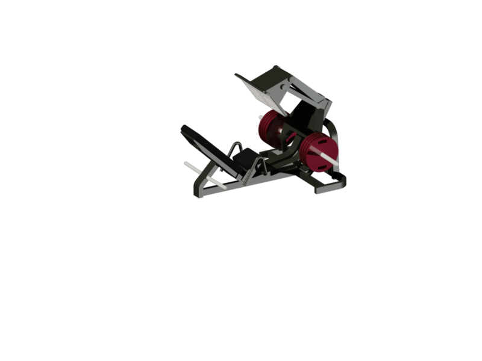

# Angled Leg Press: Complete 3D CAD Design

  

This repository contains the detailed 3D model and 2D schematics of a complete **45° angled leg press machine**. The project includes all individual components, meticulously designed in AutoCAD to reflect real-world dimensions and biomechanical efficiency.

## Project Contents

### 3D Models
The 3D models for each part of the leg press are included. These models are provided in a format compatible with AutoCAD and other 3D modeling software. The parts are designed with precision using real-world dimensions at a **1:1 scale**.

### 2D Schematics
Accompanying the 3D models are 2D schematics created using three orthographic projections (**Front View, Top View, Side View**). These schematics include precise measurements taken directly from fitness equipment to provide a detailed reference for each component.

---

## Included Components

The repository contains the following modules of the leg press machine:

* **Foot_Platform** – A textured 32.1 x 48.3 cm surface designed for recruitment of various muscle groups.
* **Foot_Platform_Support** – Structural support for the platform with a 5 cm radius fillet.
* **Foot_Platform_Frame** – The primary frame for the platform assembly measuring 35.50 x 30.50 cm.
* **Transversal_Frame** – Connecting element measuring 2.2 x 68 cm.
* **Upper_Frame** – The core moving assembly that connects user force to the weight load.
* **CSup_CTrans_Join** – Specific joining module designed with 97° and 45° angles.
* **Structural_Arch** – Main structural support featuring arcs of 53°.
* **Vertical_Arch** – Vertical support component standing 68.10 cm tall.
* **Safety_Support** – Component for the safety mechanism utilizing 133° and 131° arcs.
* **Horizontal_Arch** – Horizontal frame section with a total length of 145 cm.
* **ArchO_CBackrest_Join_Bar** – Join bar connecting the horizontal arch to the backrest frame.
* **Backrest_Frame** – Support frame for the backrest designed with 45° and 46° inclinations.
* **Backrest_Support** – Structural support for the ergonomic backrest.
* **Backrest** – Ergonomic back support with a 2.5 cm fillet for comfort.
* **Seat** – User seat with a 33.11 cm base width.
* **Seat_Support** – Support structure for the seat inclined at 32°.
* **Safety_Handle** – Manual safety control handle created using the `SWEEP` command.
* **Safety** – Core safety mechanism with a 27 cm height.
* **Weight_Support** – Cylindrical supports of 53.6 cm for weight plate loading.
* **Weight_Disk** – Standard weight plates with a 45.5 cm diameter.

---

## Technical Specifications

* **Scale**: 1:1 (Real-world dimensions).
* **Precision**: 2 decimal places accuracy.
* **Units**: Millimeters (mm).
* **Software**: AutoCAD.
* **Design Method**: 2D sketches converted to 3D models using `PRESSPULL`, `EXTRUDE`, `REVOLVE`, and `SWEEP`.
* **Layer Organization**: 27 organized layers for component separation.

---

## Credits
* **Student**: Nițuică Andrei-Sebastian.
* **Scientific Coordinator**: Lector Dr. Drăgan Mihăiță.
* **Institution**: University of Bucharest, Faculty of Mathematics and Computer Science.
